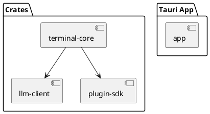

# Open Warp

Open Warp is an open-source, Warp-style terminal written in Rust with a React/Tauri user interface. The project aims to run on Windows, macOS and Linux with feature parity across platforms.

## Architecture

See `openwarp.toml` for configuration options.
